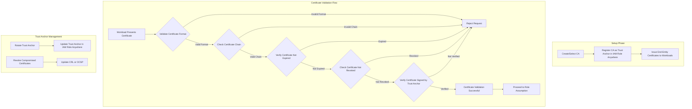
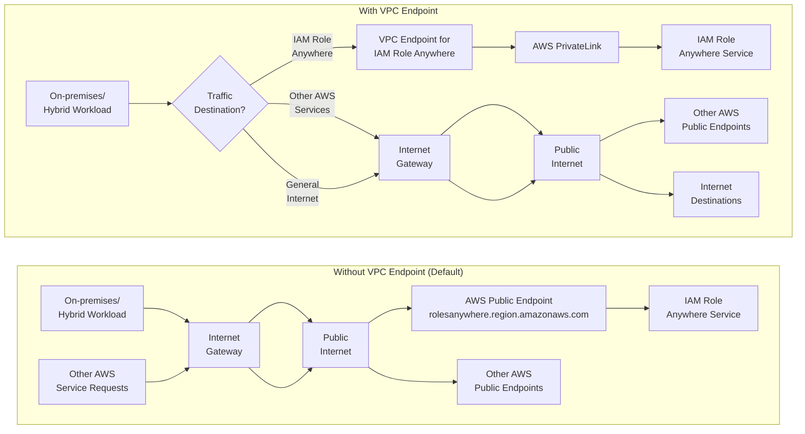
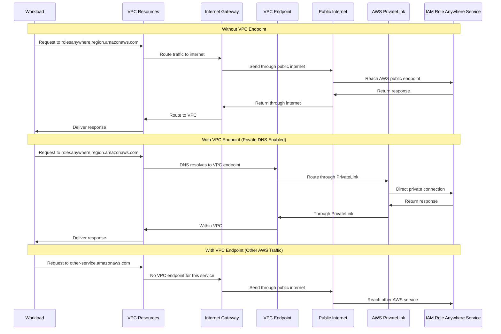
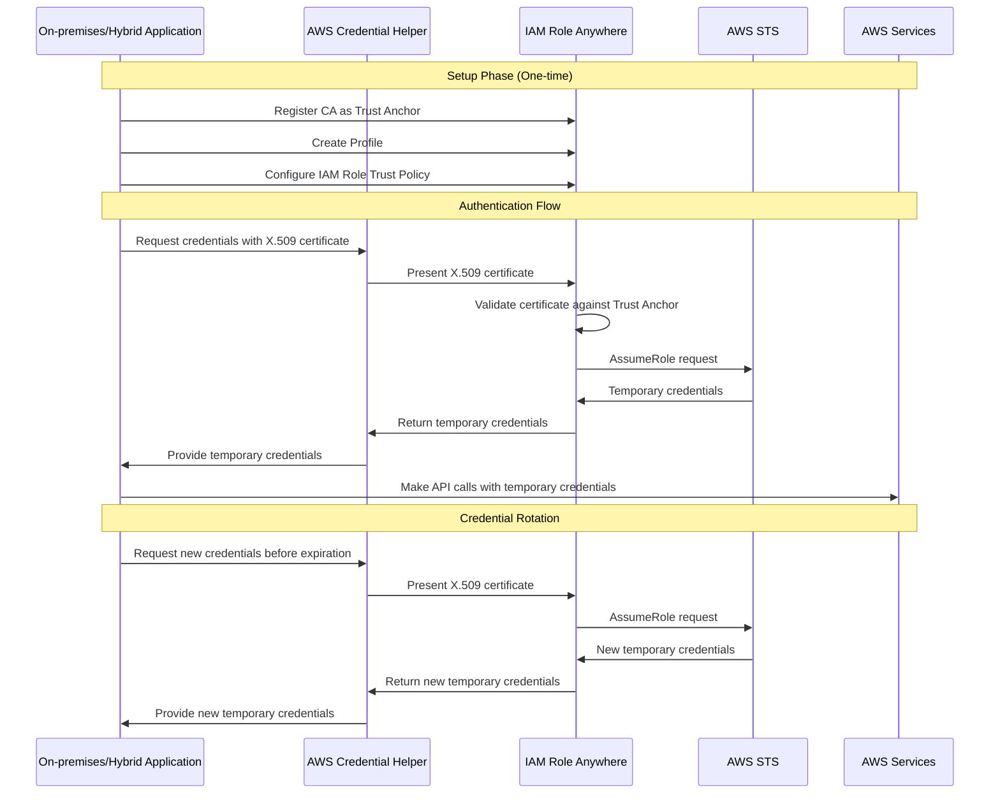

# AWS IAM Role Anywhere

## Overview

AWS IAM Role Anywhere is a service that enables workloads running outside of AWS to securely access AWS resources using temporary credentials. This service extends AWS Identity and Access Management (IAM) roles to non-AWS environments, including on-premises data centers, hybrid, and multicloud deployments.

## Table of Contents

- [Key Concepts](#key-concepts)
- [How It Works](#how-it-works)
- [Benefits](#benefits)
- [Use Cases](#use-cases)
- [Implementation Steps](#implementation-steps)
- [Best Practices](#best-practices)
- [FAQs](#faqs)

## Key Concepts

### IAM Roles

IAM roles are AWS identity entities with specific permissions that determine what actions can be performed on which AWS resources. Unlike traditional IAM users, roles don't have long-term credentials like passwords or access keys. Instead, they provide temporary security credentials for sessions.

### X.509 Certificates

IAM Role Anywhere relies on X.509 certificates for authentication. These certificates are digital documents that bind a public key to an identity and are signed by a trusted Certificate Authority (CA).

### Trust Anchors

A trust anchor in IAM Role Anywhere represents a Certificate Authority (CA) that you register with the service. This CA is used to validate the X.509 certificates presented by your workloads when requesting temporary credentials.

#### Detailed Trust Anchor Explanation

Trust anchors are a fundamental component of IAM Role Anywhere's security model. They establish the root of trust for the certificate validation process. Here's a more detailed explanation:

- **Definition**: A trust anchor is essentially a CA certificate that IAM Role Anywhere trusts implicitly
- **Purpose**: It serves as the foundation for validating the certificate chain presented by workloads
- **Types of Trust Anchors**:
  - **AWS Private CA**: A CA created and managed using AWS Certificate Manager Private CA
  - **External CA**: An enterprise or third-party CA that you manage outside of AWS
  - **Self-signed CA**: For testing purposes only, not recommended for production

- **Certificate Chain Validation**: When a workload presents its certificate, IAM Role Anywhere validates the entire certificate chain up to the trust anchor
- **Revocation Checking**: Trust anchors can be configured with Certificate Revocation Lists (CRLs) or Online Certificate Status Protocol (OCSP) endpoints
- **Multiple Trust Anchors**: You can register multiple trust anchors for redundancy or to support different certificate hierarchies

#### Trust Anchor Validation Flow



#### Detailed Trust Anchor Validation Process

The trust anchor validation flow is a critical security component of IAM Role Anywhere. Let's examine each step in detail:

##### 1. Certificate Presentation

When a workload requests temporary credentials, it must present its X.509 certificate to IAM Role Anywhere. This typically happens through the AWS credential helper tool:

```bash
aws_signing_helper credential-process \
  --certificate /path/to/certificate.pem \
  --private-key /path/to/private-key.pem \
  --trust-anchor-arn arn:aws:rolesanywhere:region:account:trust-anchor/trust-anchor-id \
  --profile-arn arn:aws:rolesanywhere:region:account:profile/profile-id \
  --role-arn arn:aws:iam::account:role/role-name
```

The certificate contains:
- The workload's public key
- Identity information (subject)
- Digital signature from the issuing CA
- Validity period
- Extensions (optional)

#### AWS Signing Helper Explained

The `aws_signing_helper` is a critical component in the IAM Role Anywhere workflow. It's a command-line utility provided by AWS that serves as the bridge between your non-AWS workloads and the IAM Role Anywhere service.

##### Purpose of the `credential-process` Command

The `credential-process` command performs several essential functions:

1. **Authentication**: It authenticates your workload to IAM Role Anywhere using the X.509 certificate
2. **Request Signing**: It signs API requests to IAM Role Anywhere using the private key corresponding to the certificate
3. **Credential Retrieval**: It obtains temporary AWS credentials (access key, secret key, session token) from IAM Role Anywhere
4. **Credential Formatting**: It outputs the credentials in a format compatible with the AWS SDK and CLI

##### Key Parameters Explained

- **`--certificate`**: Path to the X.509 certificate file in PEM format. This certificate must be issued by a CA registered as a trust anchor in IAM Role Anywhere.

- **`--private-key`**: Path to the private key file corresponding to the certificate. This key is used to sign the request to IAM Role Anywhere, proving possession of the certificate.

- **`--trust-anchor-arn`**: Amazon Resource Name (ARN) of the trust anchor registered in IAM Role Anywhere. This identifies which trust anchor should validate your certificate.

- **`--profile-arn`**: ARN of the profile in IAM Role Anywhere. The profile defines which IAM roles can be assumed by the authenticated entity.

- **`--role-arn`**: ARN of the IAM role to assume. This role must be included in the specified profile and have a trust policy that allows IAM Role Anywhere to assume it.

##### Additional Optional Parameters

- **`--session-duration`**: Duration in seconds for the temporary credentials (default: 3600, range: 900-43200)
- **`--region`**: AWS region where IAM Role Anywhere is being used
- **`--endpoint-url`**: Custom endpoint URL for IAM Role Anywhere API
- **`--intermediate-certificates`**: Path to intermediate certificates if needed for chain validation
- **`--passphrase`**: Passphrase for encrypted private key

##### Understanding IAM Role Anywhere Endpoints

The `--endpoint-url` parameter allows you to specify which IAM Role Anywhere endpoint to connect to. This is particularly important for:

1. **Regional Endpoints**: IAM Role Anywhere has region-specific endpoints
2. **VPC Endpoints**: When accessing IAM Role Anywhere through a VPC endpoint
3. **Testing/Development**: When using custom endpoints for testing
4. **FIPS Endpoints**: When compliance requires FIPS-validated endpoints

###### Standard Regional Endpoints

IAM Role Anywhere is available in most AWS regions. The standard endpoint format is:

```
rolesanywhere.{region}.amazonaws.com
```

Examples:
- `rolesanywhere.us-east-1.amazonaws.com` (US East - N. Virginia)
- `rolesanywhere.eu-west-1.amazonaws.com` (Europe - Ireland)
- `rolesanywhere.ap-southeast-1.amazonaws.com` (Asia Pacific - Singapore)

###### FIPS Endpoints

For workloads that require FIPS 140-2 validated cryptographic modules, use FIPS endpoints:

```
rolesanywhere-fips.{region}.amazonaws.com
```

Example:
```bash
aws_signing_helper credential-process \
  --endpoint-url https://rolesanywhere-fips.us-east-1.amazonaws.com \
  # other parameters
```

###### VPC Endpoints

If you're using AWS PrivateLink to access IAM Role Anywhere via a VPC endpoint:

```bash
aws_signing_helper credential-process \
  --endpoint-url https://vpce-{vpce-id}.rolesanywhere.{region}.vpce.amazonaws.com \
  # other parameters
```

###### How Traffic Routing Works with VPC Endpoints

When you create a VPC endpoint for IAM Role Anywhere, it changes how network traffic is routed:



1. **Without VPC Endpoint (Default)**:
   - Traffic from your workload to IAM Role Anywhere follows this path:
     - Workload → Internet Gateway → Public Internet → AWS Public Endpoint
   - Requires internet access for your workloads
   - Uses public DNS resolution for `rolesanywhere.{region}.amazonaws.com`

2. **With VPC Endpoint**:
   - Traffic from your workload to IAM Role Anywhere follows this path:
     - Workload → VPC Endpoint (in your VPC) → AWS PrivateLink → IAM Role Anywhere Service
   - Stays entirely within the AWS network
   - Uses either the endpoint-specific DNS name or the standard service DNS name (if private DNS is enabled)

3. **Traffic Routing Control**:
   - **Only IAM Role Anywhere Traffic**: The VPC endpoint only affects traffic destined for the IAM Role Anywhere service
   - **Other AWS Services**: Not affected unless you create separate VPC endpoints for them
   - **Internet Traffic**: Other internet-bound traffic still uses your normal internet gateway or NAT gateway

4. **DNS Resolution**:
   - With private DNS enabled (default): Requests to `rolesanywhere.{region}.amazonaws.com` automatically route through the VPC endpoint
   - Without private DNS: You must explicitly use the endpoint-specific URL: `vpce-{id}.rolesanywhere.{region}.vpce.amazonaws.com`

5. **Selective Routing**:
   - You can choose which workloads use the VPC endpoint by:
     - Network access controls (security groups, NACLs)
     - Explicitly configuring some workloads to use the public endpoint and others to use the VPC endpoint
     - Using endpoint policies to restrict which IAM principals can use the endpoint

###### Detailed Network Flow Comparison



###### Why Use VPC Endpoints with IAM Role Anywhere

VPC endpoints for IAM Role Anywhere provide several critical benefits for enterprise and security-focused environments:

1. **Enhanced Security**
   - **Private Network Path**: Traffic between your workloads and IAM Role Anywhere stays within the AWS network and never traverses the public internet
   - **Network Isolation**: Workloads in private subnets without internet access can still authenticate to AWS
   - **Reduced Attack Surface**: Eliminates exposure to internet-based threats and DDoS attacks

2. **Compliance Requirements**
   - **Data Sovereignty**: Helps meet regulatory requirements that mandate data must not traverse the public internet
   - **Audit Controls**: Provides additional network-level audit points for compliance frameworks
   - **Security Boundaries**: Creates clear network boundaries for security certification requirements

3. **Network Performance and Reliability**
   - **Reduced Latency**: Direct connection to AWS services without internet routing
   - **Bandwidth Predictability**: Avoids internet congestion issues
   - **Connection Stability**: More reliable connections without internet-related disruptions

4. **Cost Optimization**
   - **Reduced NAT Gateway Costs**: Eliminates the need to route traffic through NAT gateways for private subnets
   - **Bandwidth Savings**: No charges for data transfer to the internet

###### Common Use Cases for VPC Endpoints with IAM Role Anywhere

1. **Hybrid Cloud with Private Connectivity**
   - On-premises workloads connected to AWS via Direct Connect or VPN can access IAM Role Anywhere without internet exposure
   - Example: Enterprise applications in corporate data centers authenticating to AWS services

2. **Highly Regulated Environments**
   - Financial, healthcare, and government workloads that must maintain strict network isolation
   - Example: Healthcare applications processing PHI (Protected Health Information) that need AWS access

3. **Air-Gapped or Internet-Restricted Environments**
   - Environments with no direct internet access for security reasons
   - Example: Manufacturing control systems or critical infrastructure that need AWS services

4. **Multi-Account AWS Architectures**
   - Centralized authentication services in a dedicated AWS account accessed by workloads in other accounts
   - Example: Shared services VPC providing IAM Role Anywhere access to workloads in application VPCs

###### Implementation Steps for VPC Endpoints

1. **Create the VPC Endpoint**
   ```bash
   aws ec2 create-vpc-endpoint \
     --vpc-id vpc-12345678 \
     --service-name com.amazonaws.{region}.rolesanywhere \
     --vpc-endpoint-type Interface \
     --subnet-ids subnet-12345678 subnet-87654321 \
     --security-group-ids sg-12345678
   ```

2. **Configure DNS Resolution**
   - Enable private DNS for the endpoint to use the standard service DNS name
   - Or configure custom DNS to resolve the VPC endpoint DNS name

3. **Update Security Groups**
   - Allow HTTPS (TCP port 443) traffic from your workloads to the VPC endpoint

4. **Configure the Credential Helper**
   - Use the VPC endpoint URL with the `aws_signing_helper` as shown above

###### Security Considerations for VPC Endpoints

1. **Endpoint Policies**: Apply IAM policies to your VPC endpoint to control which principals can use the endpoint

2. **Security Groups**: Restrict access to the VPC endpoint using security groups

3. **Private DNS**: Consider the implications of enabling or disabling private DNS for the endpoint

4. **Logging and Monitoring**: Enable VPC Flow Logs to monitor traffic to and from the endpoint

###### Dual-stack Endpoints

For IPv6 support, use dual-stack endpoints:

```
rolesanywhere.{region}.api.aws
```

###### Global vs. Regional Considerations

Unlike some AWS services, IAM Role Anywhere does not have a global endpoint. You must use the regional endpoint where your trust anchors and profiles are defined.

###### Endpoint Configuration Best Practices

1. **Region Consistency**: Ensure the region in your endpoint matches the region where your trust anchors and profiles are created

2. **Failover Strategy**: For high availability, implement logic to try alternative regional endpoints if your primary endpoint is unavailable

3. **Network Access**: Ensure your network allows outbound connections to the IAM Role Anywhere endpoints (port 443/HTTPS)

4. **Endpoint Verification**: For security-critical applications, consider implementing TLS certificate pinning for the IAM Role Anywhere endpoints

5. **Monitoring**: Set up monitoring for endpoint connectivity to detect issues early

##### Using Passphrase-Protected Private Keys

If you created your certificate and private key with a passphrase (using the `-passin` option with OpenSSL), you **must** provide this passphrase to the `aws_signing_helper` using the `--passphrase` parameter:

```bash
aws_signing_helper credential-process \
  --certificate /path/to/certificate.pem \
  --private-key /path/to/encrypted-private-key.pem \
  --passphrase "your-private-key-passphrase" \
  --trust-anchor-arn arn:aws:rolesanywhere:region:account:trust-anchor/trust-anchor-id \
  --profile-arn arn:aws:rolesanywhere:region:account:profile/profile-id \
  --role-arn arn:aws:iam::account:role/role-name
```

Without the correct passphrase, the `aws_signing_helper` will not be able to use your private key to sign requests, and you'll receive an error similar to:

```
Error: failed to load private key: x509: decryption password incorrect
```

###### Security Considerations for Passphrases

When using passphrase-protected private keys:

- **Avoid hardcoding passphrases** in scripts or configuration files
- Consider using environment variables for passphrases:
  ```bash
  export PRIVATE_KEY_PASSPHRASE="your-passphrase"
  aws_signing_helper credential-process \
    --passphrase "$PRIVATE_KEY_PASSPHRASE" \
    # other parameters
  ```
- For production environments, use a secrets management solution like AWS Secrets Manager or HashiCorp Vault to retrieve passphrases
- In automated environments, consider using non-encrypted keys with very strict file permissions and secure storage

##### Integration with AWS CLI and SDKs

The `credential-process` command outputs JSON in the format expected by the AWS CLI's credential_process configuration. This allows seamless integration with the AWS CLI and SDKs:

```json
{
  "Version": 1,
  "AccessKeyId": "ASIA...",
  "SecretAccessKey": "...",
  "SessionToken": "...",
  "Expiration": "2023-01-01T00:00:00Z"
}
```

To configure the AWS CLI to use IAM Role Anywhere credentials:

```ini
# ~/.aws/config
[profile role-anywhere]
credential_process = /path/to/aws_signing_helper credential-process --certificate /path/to/certificate.pem --private-key /path/to/private-key.pem --trust-anchor-arn arn:aws:rolesanywhere:region:account:trust-anchor/id --profile-arn arn:aws:rolesanywhere:region:account:profile/id --role-arn arn:aws:iam::account:role/role-name
```

##### 2. Format Validation

IAM Role Anywhere first validates that the certificate adheres to the X.509 standard format:

- Checks that the certificate is properly encoded (DER/PEM format)
- Verifies that all required X.509 fields are present
- Validates that the certificate structure is correct
- Ensures the certificate uses supported cryptographic algorithms

##### 3. Certificate Chain Validation

Next, IAM Role Anywhere validates the certificate chain from the end-entity certificate up to the trust anchor:

- Verifies that each certificate in the chain is signed by its issuer
- Ensures that the chain is complete with no missing intermediate certificates
- Checks that the chain terminates with the registered trust anchor

For a certificate chain: End-entity → Intermediate CA → Root CA (Trust Anchor), IAM Role Anywhere verifies:
- End-entity certificate is signed by Intermediate CA
- Intermediate CA is signed by Root CA
- Root CA matches the registered trust anchor

##### 4. Expiration Check

IAM Role Anywhere verifies that all certificates in the chain are within their validity period:

- Checks the `notBefore` date to ensure the certificate is already valid
- Checks the `notAfter` date to ensure the certificate has not expired
- Validates that all intermediate certificates in the chain are also within their validity periods

##### 5. Revocation Check

IAM Role Anywhere checks if any certificate in the chain has been revoked using one or both methods:

- **Certificate Revocation Lists (CRLs)**: IAM Role Anywhere downloads and checks CRLs published by the CA
- **Online Certificate Status Protocol (OCSP)**: IAM Role Anywhere makes real-time queries to OCSP responders

To enable revocation checking, you must configure the trust anchor with CRL distribution points or OCSP responder URLs.

##### 6. Trust Anchor Verification

IAM Role Anywhere verifies that the root CA in the chain matches a registered trust anchor:

- Compares the Subject Key Identifier (SKI) and/or Subject Distinguished Name (DN)
- Verifies the public key matches the registered trust anchor
- Ensures the trust anchor is enabled and not suspended

##### 7. Additional Validation Checks

Depending on configuration, IAM Role Anywhere may perform additional checks:

- **Subject Alternative Name (SAN)**: Validates specific DNS names or IP addresses in the certificate
- **Key Usage**: Ensures the certificate has appropriate key usage extensions (e.g., digital signature)
- **Extended Key Usage**: Verifies the certificate is authorized for client authentication
- **Certificate Policies**: Checks for specific policy OIDs required by your configuration

##### 8. Role Assumption

After successful certificate validation, IAM Role Anywhere:

1. Extracts identity information from the certificate (subject, SAN, etc.)
2. Maps this identity to IAM roles based on the profile configuration
3. Calls AWS STS AssumeRole API with appropriate session tags derived from the certificate
4. Returns temporary credentials to the workload

##### Common Validation Failures

| Failure Type | Common Causes | Troubleshooting |
|--------------|---------------|------------------|
| Format Error | Corrupted certificate, Unsupported algorithm | Check certificate encoding, Verify supported algorithms |
| Chain Error | Missing intermediate certificate, Incorrect chain order | Ensure complete certificate chain, Verify chain order |
| Expiration Error | Certificate expired, Clock skew | Check certificate validity dates, Verify system time |
| Revocation Error | Certificate revoked, CRL/OCSP unavailable | Check certificate status, Verify CRL/OCSP accessibility |
| Trust Anchor Error | Trust anchor not registered, Trust anchor disabled | Verify trust anchor registration, Check trust anchor status |

#### Trust Anchor Security Considerations

- **Protection**: The private key of your trust anchor CA must be highly protected as it represents the root of trust
- **Rotation**: Implement a process for rotating trust anchors before they expire
- **Revocation**: Maintain up-to-date certificate revocation mechanisms
- **Monitoring**: Set up alerts for trust anchor expiration and usage anomalies
- **Backup**: Ensure you have backup procedures for your trust anchor private keys and certificates

### Profiles

Profiles in IAM Role Anywhere define which roles can be assumed by authenticated entities and under what conditions. Profiles are associated with trust anchors and contain session policies that can further restrict permissions.

## How It Works

IAM Role Anywhere follows these steps to provide temporary credentials:

1. **Setup Phase**:
   - Register your Certificate Authority (CA) with IAM Role Anywhere as a trust anchor
   - Create profiles that define which IAM roles can be assumed
   - Configure IAM roles with a trust policy that allows the IAM Role Anywhere service to assume them

2. **Authentication Flow**:
   - Your workload presents its X.509 certificate to IAM Role Anywhere
   - IAM Role Anywhere validates the certificate against the registered trust anchor
   - Upon successful validation, IAM Role Anywhere assumes the specified IAM role
   - Temporary security credentials (access key, secret key, session token) are returned to your workload
   - Your workload uses these temporary credentials to make AWS API calls

3. **Credential Rotation**:
   - Credentials automatically expire after a configurable period (default: 1 hour)
   - Your workload must request new credentials before the current ones expire

### Authentication Flow Diagram



## Benefits

### Enhanced Security

- **Eliminate Long-term Credentials**: No need to store long-term access keys in your applications or configuration files
- **Automatic Rotation**: Credentials are short-lived and automatically rotated
- **Certificate-based Authentication**: Leverages industry-standard PKI infrastructure for strong authentication
- **Fine-grained Access Control**: Use IAM policies to precisely control access to AWS resources

### Operational Efficiency

- **Consistent Access Management**: Use the same IAM roles and policies across all environments
- **Reduced Credential Management Overhead**: No need to build and maintain systems for distributing and rotating access keys
- **Centralized Governance**: Manage access for all workloads from a single control plane

### Flexibility

- **Environment Agnostic**: Works in on-premises, hybrid, and multicloud environments
- **Integration Friendly**: Compatible with existing PKI infrastructure
- **Support for Various Workloads**: Suitable for servers, containers, applications, and IoT devices

## Use Cases

### On-premises Applications

Enable legacy applications running in your data center to securely access AWS services without embedding long-term credentials.

```
On-premises Server → IAM Role Anywhere → Temporary Credentials → AWS Services
```

### Hybrid Cloud Deployments

Provide consistent authentication mechanisms for workloads that span both on-premises and AWS environments.

```
Hybrid Application → IAM Role Anywhere → Temporary Credentials → AWS Services
```

### Multicloud Environments

Allow applications running on other cloud providers to access AWS resources securely.

```
Application on Other Cloud → IAM Role Anywhere → Temporary Credentials → AWS Services
```

### Third-party Integrations

Enable third-party applications like Salesforce to access AWS resources using temporary credentials.

```
Third-party Application → IAM Role Anywhere → Temporary Credentials → AWS Services
```

## Implementation Steps

### 1. Set Up a Certificate Authority

You can use:
- AWS Private Certificate Authority (PCA)
- An existing enterprise PKI
- A self-signed CA (for testing only)

### 2. Register Your CA with IAM Role Anywhere

```bash
# Using AWS CLI
aws rolesanywhere create-trust-anchor \
  --name "MyTrustAnchor" \
  --source "sourceData={x509CertificateData=file://ca.pem}" \
  --enabled
```

### 3. Create IAM Roles with Appropriate Trust Policies

Example trust policy:

```json
{
  "Version": "2012-10-17",
  "Statement": [
    {
      "Effect": "Allow",
      "Principal": {
        "Service": "rolesanywhere.amazonaws.com"
      },
      "Action": [
        "sts:AssumeRole",
        "sts:TagSession"
      ],
      "Condition": {
        "StringEquals": {
          "aws:PrincipalTag/x509Subject/CN": "example.com"
        }
      }
    }
  ]
}
```

### 4. Create a Profile in IAM Role Anywhere

```bash
# Using AWS CLI
aws rolesanywhere create-profile \
  --name "MyProfile" \
  --role-arns "arn:aws:iam::123456789012:role/MyRole" \
  --enabled
```

### 5. Install the AWS Credentials Helper

Download the credential helper from AWS:
- [AWS Signing Helper](https://docs.aws.amazon.com/rolesanywhere/latest/userguide/credential-helper.html)

### 6. Request Temporary Credentials

```bash
# Using the credential helper
aws_signing_helper credential-process \
  --certificate /path/to/certificate.pem \
  --private-key /path/to/private-key.pem \
  --trust-anchor-arn arn:aws:rolesanywhere:region:account:trust-anchor/trust-anchor-id \
  --profile-arn arn:aws:rolesanywhere:region:account:profile/profile-id \
  --role-arn arn:aws:iam::account:role/role-name
```

### 7. Configure Your Application to Use Temporary Credentials

The credential helper outputs JSON that can be used directly with AWS SDKs and the AWS CLI.

## Best Practices

### Security

- **Protect Private Keys**: Store private keys securely using solutions like AWS Secrets Manager or HashiCorp Vault
- **Implement Certificate Rotation**: Regularly rotate certificates before they expire
- **Use Strong Certificate Policies**: Enforce appropriate key lengths and signature algorithms
- **Apply Least Privilege**: Grant only the permissions necessary for each workload

### Operational

- **Monitor Usage**: Enable AWS CloudTrail to track credential requests and usage
- **Implement Alerting**: Set up alerts for suspicious activity or failed authentication attempts
- **Test Certificate Renewal**: Regularly test your certificate renewal process
- **Document Procedures**: Create clear documentation for certificate management and troubleshooting

### Resilience

- **Plan for CA Unavailability**: Have backup CAs registered as trust anchors
- **Implement Retry Logic**: Add appropriate retry mechanisms for credential requests
- **Cache Credentials**: Cache credentials locally (securely) to handle temporary service disruptions
- **Cross-region Support**: Consider registering trust anchors in multiple AWS regions

## FAQs

### Q: What happens if my certificate expires?
A: If your certificate expires, you won't be able to authenticate with IAM Role Anywhere. Implement proactive certificate rotation before expiration.

### Q: Can I use self-signed certificates?
A: Yes, for testing purposes. For production, use a proper CA infrastructure.

### Q: How often are credentials rotated?
A: By default, credentials are valid for 1 hour. You can configure this duration (between 15 minutes and 12 hours) when requesting credentials.

### Q: Does IAM Role Anywhere work with all AWS services?
A: Yes, the temporary credentials obtained through IAM Role Anywhere work with all AWS services, subject to the permissions defined in the IAM role.

### Q: Is there an additional cost for using IAM Role Anywhere?
A: Yes, IAM Role Anywhere charges based on the number of authentication requests. Check the [AWS pricing page](https://aws.amazon.com/iam/roles-anywhere/pricing/) for current rates.

### Q: Can I use IAM Role Anywhere with the AWS SDK?
A: Yes, all AWS SDKs support the credential format provided by the AWS credential helper.

---

For more information, visit the [official AWS IAM Role Anywhere documentation](https://docs.aws.amazon.com/rolesanywhere/latest/userguide/introduction.html).
